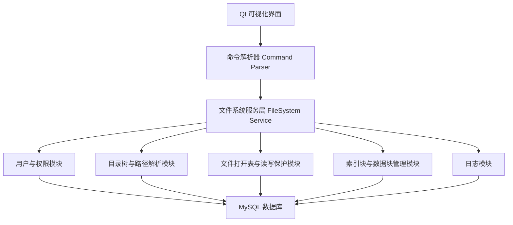
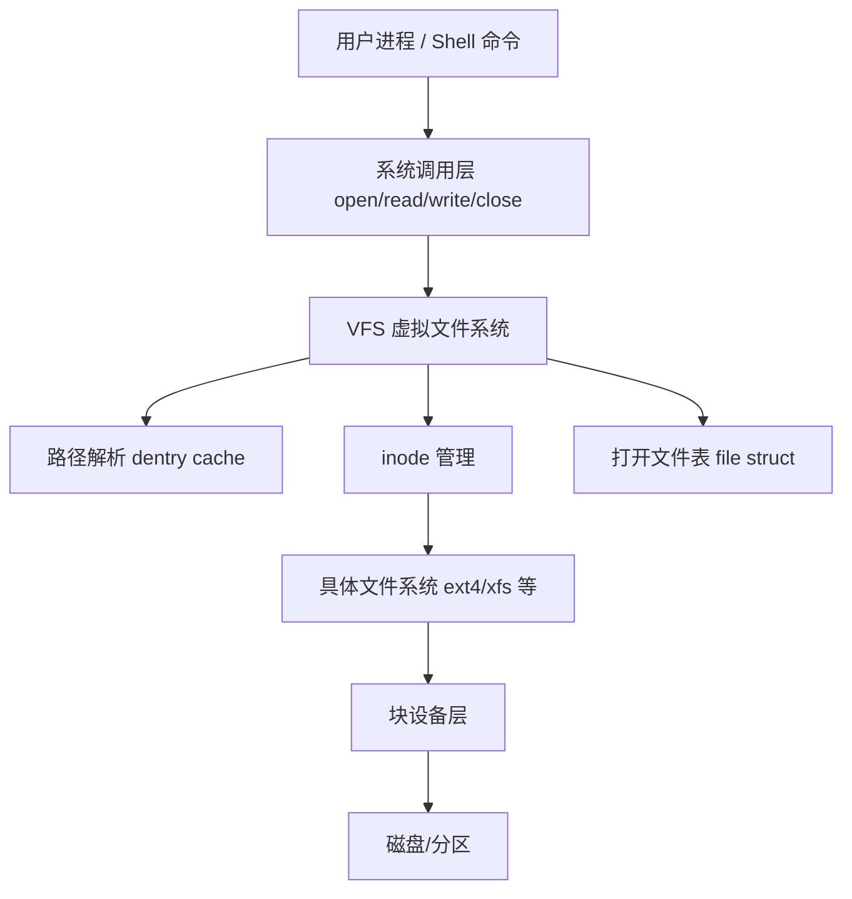

# 小型多用户模拟文件系统需求文档

## 1. Executive Summary

**Problem Statement**  
操作系统课程设计需要学生理解 Linux 文件系统的层次结构、核心数据结构、文件访问权限和并发保护机制，但直接修改或完整复现真实 Linux 文件系统成本较高、风险较大。  
本项目通过 C/C++ 在 Linux 环境下模拟一个多用户小型文件系统，使用户能够通过类 Linux 终端和 Qt 可视化界面完成文件/目录管理、权限控制、文件读写和并发保护操作。

**Proposed Solution**  
系统采用“模拟文件系统核心 + Qt 图形界面 + MySQL 数据库存储”的架构。核心模块负责用户、目录树、文件索引、打开文件表、权限校验和读写互斥控制；Qt 界面提供终端式命令输入、目录树展示、文件属性编辑和并发访问状态可视化；MySQL 保存用户、文件节点、权限、索引块、数据块和操作日志。

**Success Criteria**

- 支持不少于 3 个用户账号，并能区分普通用户与管理员权限。
- 支持不少于 10 个类 Linux 基本命令，包括 `login`、`logout`、`mkdir`、`rmdir`、`create`、`open`、`close`、`read`、`write`、`ls`、`cd`、`chmod`、`rm`。
- 文件系统以树状结构组织，支持根目录、子目录、普通文件和路径解析。
- 权限控制满足用户/用户组/其他用户的读、写、执行权限判断。
- 文件保护满足“读读允许、读写互斥、写写互斥”，并能在界面中展示文件当前读写占用状态。
- 系统重启后，MySQL 中保存的用户、目录、文件、权限、索引和日志数据可恢复。
- 完成 Linux 文件系统部分源码解读，并绘制功能结构框图。

## 2. User Experience & Functionality

### User Personas

**课程学生/开发者**  
需要实现并演示一个小型文件系统，理解 Linux 文件系统中的 inode、目录项、超级块、文件描述符、权限控制和读写并发保护思想。

**普通系统用户**  
通过图形界面或类终端命令创建、查看、读写和删除自己有权限访问的文件与目录。

**管理员用户**  
负责创建用户、管理用户组、修改文件权限、查看系统日志和维护文件系统整体状态。

### User Stories

**Story 1: Linux 文件系统源码解读**  
As a 学生, I want to 解读 Linux 文件系统关键源码 so that 我能说明真实文件系统和模拟系统之间的设计对应关系。

**Acceptance Criteria**

- 至少分析 Linux VFS 层相关源码概念，包括 `super_block`、`inode`、`dentry`、`file`。
- 至少说明一次文件打开、路径查找、读写调用的大致流程。
- 输出一张功能结构框图，包含用户接口层、VFS 抽象层、目录/索引管理、数据块管理、权限管理、缓存/打开文件表等模块。
- 在需求文档或设计文档中说明本系统对 Linux 文件系统核心概念的简化映射。

**Story 2: 多用户登录与身份管理**  
As a 用户, I want to 登录系统 so that 文件系统可以根据我的身份判断访问权限。

**Acceptance Criteria**

- 系统支持用户注册、登录、退出登录。
- 用户信息至少包含用户 ID、用户名、密码哈希、用户组、角色、创建时间。
- 未登录用户不能执行文件创建、打开、读写、删除、权限修改等操作。
- 管理员可以查看用户列表，并能启用或禁用普通用户。

**Story 3: 树状目录和路径管理**  
As a 用户, I want to 使用类似 Linux 的目录结构 so that 我可以通过路径定位文件和目录。

**Acceptance Criteria**

- 系统必须存在根目录 `/`。
- 支持绝对路径和相对路径解析，例如 `/home/user/a.txt`、`../docs/readme.txt`。
- 每个目录可以包含多个子目录和文件。
- 同一目录下不允许出现同名文件或同名目录。
- `ls` 命令可以显示文件名、类型、大小、所有者、权限和修改时间。
- Qt 界面左侧应以树形控件展示目录结构。

**Story 4: 文件/目录基本命令**  
As a 用户, I want to 使用类 Linux 命令操作文件系统 so that 我可以像使用终端一样完成基本文件操作。

**Acceptance Criteria**

- 支持 `mkdir path` 创建目录。
- 支持 `rmdir path` 删除空目录。
- 支持 `create path` 创建普通文件。
- 支持 `open path mode` 打开文件，`mode` 至少包括 `r`、`w`、`rw`。
- 支持 `close fd` 关闭文件描述符。
- 支持 `read fd size` 读取指定大小数据。
- 支持 `write fd content` 写入文本内容。
- 支持 `rm path` 删除普通文件。
- 支持 `cd path` 切换当前目录。
- 支持 `pwd` 显示当前路径。
- 支持 `chmod path mode` 修改权限。
- 支持 `stat path` 查看文件元信息。
- 命令执行结果应同时显示在 Qt 终端输出区域和操作日志中。

**Story 5: 文件存储和索引模拟**  
As a 学生, I want to 模拟文件块和索引结构 so that 我能理解文件内容如何从逻辑文件映射到物理块。

**Acceptance Criteria**

- 系统将文件内容拆分为固定大小的数据块，建议块大小为 512B、1KB 或 4KB。
- 每个文件节点维护索引信息，记录文件占用的数据块编号。
- 支持直接索引；扩展目标可支持一级间接索引。
- 文件写入时自动分配空闲数据块。
- 文件删除时释放对应数据块。
- 系统可展示磁盘块使用情况，包括总块数、已用块数、空闲块数。

**Story 6: 权限控制**  
As a 文件所有者, I want to 设置文件和目录访问权限 so that 我可以保护自己的文件不被未授权用户访问。

**Acceptance Criteria**

- 每个文件/目录必须保存所有者、所属用户组和权限位。
- 权限模型采用类 Linux `rwx` 格式，分为 owner、group、others 三组。
- 读权限控制 `read`、`ls`、`stat` 等读取操作。
- 写权限控制 `write`、`create`、`rm`、`mkdir`、`rmdir` 等修改操作。
- 执行权限用于目录进入和路径穿越。
- 管理员拥有权限覆盖能力。
- 无权限操作必须返回明确错误信息，例如 `Permission denied`。

**Story 7: 文件保护和并发读写控制**  
As a 用户, I want to 在多人访问同一文件时得到正确的读写保护 so that 文件内容不会因并发操作产生冲突。

**Acceptance Criteria**

- 同一文件允许多个用户同时以只读模式打开。
- 当文件已被一个或多个用户以只读模式打开时，其他用户不能以写模式或读写模式打开。
- 当文件已被某个用户以写模式或读写模式打开时，其他用户不能以读模式、写模式或读写模式打开。
- 系统维护打开文件表，记录文件描述符、用户 ID、文件 ID、打开模式、读写偏移、打开时间。
- Qt 界面应展示当前被打开的文件、打开用户、打开模式和锁状态。
- 关闭文件后，对应读写保护状态应自动释放。

**Story 8: Qt 可视化界面**  
As a 用户, I want to 通过图形界面操作文件系统 so that 我可以更直观地查看目录结构、文件属性和系统状态。

**Acceptance Criteria**

- 主界面至少包含目录树区域、文件列表区域、命令输入区域、命令输出区域、文件属性区域。
- 支持通过按钮或右键菜单创建文件、创建目录、删除、重命名、打开、关闭、读写、修改权限。
- 支持通过表格展示打开文件表、数据块占用情况和操作日志。
- 权限编辑可使用复选框展示 owner/group/others 的 `rwx` 权限位。
- 并发锁状态可通过状态标签或颜色区分空闲、只读占用、写占用。

### Non-Goals

- 不直接修改 Linux 内核源码。
- 不实现真实磁盘驱动或真实 ext4 文件系统挂载。
- 不要求兼容全部 Linux shell 命令。
- 不要求支持二进制大文件、高性能缓存或分布式文件系统。
- 不要求实现完整 POSIX 标准。

## 3. AI System Requirements

本项目不包含 AI 功能，因此无需 AI 模型、提示词、推理接口或模型评估机制。

## 4. Technical Specifications

### Architecture Overview

系统采用分层架构：



### Linux 文件系统源码解读范围

本项目建议重点解读 Linux VFS 相关结构与调用流程，不要求完整分析 ext4 实现。

**重点源码概念**

- `struct super_block`：表示一个已挂载文件系统的整体信息。
- `struct inode`：表示文件或目录的元数据，如权限、所有者、大小、时间戳。
- `struct dentry`：表示目录项，用于路径名到 inode 的映射。
- `struct file`：表示进程打开的文件实例，包含访问模式、文件偏移和操作函数。
- `file_operations`：定义文件读、写、打开、释放等操作接口。

**简化映射关系**

| Linux 文件系统概念 | 本系统对应设计 |
|---|---|
| super_block | `fs_meta` 表和系统配置模块 |
| inode | `fs_node` 表中的文件/目录节点 |
| dentry | `fs_node.parent_id + name` 形成目录项关系 |
| file | `open_file` 表中的打开文件记录 |
| file descriptor | 系统运行时分配的 `fd` |
| data block | `data_block` 表中的模拟数据块 |
| file_operations | C++ `FileSystemService` 的 create/open/read/write/close 方法 |

**Linux 文件系统功能结构框图**



### Core Modules

**1. Command Parser 命令解析器**

- 输入：用户在 Qt 命令行输入的字符串。
- 输出：标准化命令对象，例如 `{command: "write", args: ["3", "hello"]}`。
- 负责参数数量校验、路径字符串预处理和错误提示。

**2. UserManager 用户管理模块**

- 负责注册、登录、登出、用户组、角色和用户状态管理。
- 登录成功后生成当前会话对象 `Session`。

**3. FileSystemService 文件系统服务层**

- 提供统一 API：`create`、`mkdir`、`open`、`close`、`read`、`write`、`rm`、`rmdir`、`chmod`、`stat`。
- 协调权限校验、路径解析、数据块分配和日志写入。

**4. PathResolver 路径解析模块**

- 将绝对路径或相对路径解析为节点 ID。
- 校验路径穿越过程中的目录执行权限。
- 处理 `.`、`..` 和重复 `/`。

**5. PermissionManager 权限模块**

- 根据当前用户、文件所有者、所属用户组和权限位判断操作是否允许。
- 支持管理员绕过普通权限限制。

**6. StorageManager 存储管理模块**

- 负责模拟磁盘块分配、释放、读取和写入。
- 维护文件节点与数据块之间的索引关系。

**7. OpenFileManager 打开文件表与保护模块**

- 分配和回收文件描述符。
- 维护文件打开模式、偏移量和锁状态。
- 实现读读允许、读写互斥、写写互斥。

**8. Qt UI 模块**

- 展示目录树、文件列表、命令行、属性面板、打开文件表、块使用情况和日志。
- 将按钮、菜单和命令行操作统一转发给 FileSystemService。

### Data Structure Design

**C++ 核心结构建议**

```cpp
enum class NodeType {
    File,
    Directory
};

enum class OpenMode {
    Read,
    Write,
    ReadWrite
};

struct PermissionBits {
    bool ownerRead;
    bool ownerWrite;
    bool ownerExec;
    bool groupRead;
    bool groupWrite;
    bool groupExec;
    bool otherRead;
    bool otherWrite;
    bool otherExec;
};

struct FsNode {
    int id;
    int parentId;
    std::string name;
    NodeType type;
    int ownerUserId;
    int groupId;
    PermissionBits permissions;
    size_t size;
    time_t createdAt;
    time_t updatedAt;
};

struct OpenFileEntry {
    int fd;
    int nodeId;
    int userId;
    OpenMode mode;
    size_t offset;
    time_t openedAt;
};

struct DataBlock {
    int blockId;
    bool used;
    std::string content;
};
```

### MySQL Database Design

**1. 用户表 `users`**

| 字段 | 类型 | 说明 |
|---|---|---|
| id | BIGINT PRIMARY KEY AUTO_INCREMENT | 用户 ID |
| username | VARCHAR(64) UNIQUE NOT NULL | 用户名 |
| password_hash | VARCHAR(255) NOT NULL | 密码哈希 |
| group_id | BIGINT NOT NULL | 所属用户组 |
| role | ENUM('admin','user') NOT NULL | 用户角色 |
| status | ENUM('active','disabled') NOT NULL | 用户状态 |
| created_at | DATETIME NOT NULL | 创建时间 |

**2. 用户组表 `user_groups`**

| 字段 | 类型 | 说明 |
|---|---|---|
| id | BIGINT PRIMARY KEY AUTO_INCREMENT | 用户组 ID |
| group_name | VARCHAR(64) UNIQUE NOT NULL | 用户组名称 |
| created_at | DATETIME NOT NULL | 创建时间 |

**3. 文件节点表 `fs_nodes`**

| 字段 | 类型 | 说明 |
|---|---|---|
| id | BIGINT PRIMARY KEY AUTO_INCREMENT | 节点 ID |
| parent_id | BIGINT NULL | 父目录 ID，根目录为空 |
| name | VARCHAR(255) NOT NULL | 文件或目录名 |
| node_type | ENUM('file','directory') NOT NULL | 节点类型 |
| owner_user_id | BIGINT NOT NULL | 所有者 |
| group_id | BIGINT NOT NULL | 所属组 |
| permission | CHAR(9) NOT NULL | 权限字符串，如 `rwxr-x---` |
| size_bytes | BIGINT NOT NULL DEFAULT 0 | 文件大小 |
| created_at | DATETIME NOT NULL | 创建时间 |
| updated_at | DATETIME NOT NULL | 修改时间 |
| deleted | BOOLEAN NOT NULL DEFAULT FALSE | 逻辑删除标记 |

约束：

- `UNIQUE(parent_id, name, deleted)` 避免同一目录下出现同名有效节点。
- `parent_id` 关联 `fs_nodes.id`。
- `owner_user_id` 关联 `users.id`。

**4. 数据块表 `data_blocks`**

| 字段 | 类型 | 说明 |
|---|---|---|
| id | BIGINT PRIMARY KEY AUTO_INCREMENT | 数据块 ID |
| block_no | BIGINT UNIQUE NOT NULL | 模拟物理块编号 |
| used | BOOLEAN NOT NULL DEFAULT FALSE | 是否已占用 |
| content | BLOB | 块内容 |
| updated_at | DATETIME NOT NULL | 更新时间 |

**5. 文件索引表 `file_block_index`**

| 字段 | 类型 | 说明 |
|---|---|---|
| id | BIGINT PRIMARY KEY AUTO_INCREMENT | 索引 ID |
| file_node_id | BIGINT NOT NULL | 文件节点 ID |
| logical_block_no | BIGINT NOT NULL | 文件内逻辑块号 |
| data_block_id | BIGINT NOT NULL | 对应数据块 ID |

约束：

- `UNIQUE(file_node_id, logical_block_no)`。

**6. 打开文件表 `open_files`**

| 字段 | 类型 | 说明 |
|---|---|---|
| id | BIGINT PRIMARY KEY AUTO_INCREMENT | 记录 ID |
| fd | BIGINT NOT NULL | 文件描述符 |
| user_id | BIGINT NOT NULL | 打开用户 |
| file_node_id | BIGINT NOT NULL | 文件节点 |
| open_mode | ENUM('r','w','rw') NOT NULL | 打开模式 |
| offset_bytes | BIGINT NOT NULL DEFAULT 0 | 当前读写偏移 |
| opened_at | DATETIME NOT NULL | 打开时间 |
| closed_at | DATETIME NULL | 关闭时间 |
| active | BOOLEAN NOT NULL DEFAULT TRUE | 是否仍处于打开状态 |

**7. 操作日志表 `operation_logs`**

| 字段 | 类型 | 说明 |
|---|---|---|
| id | BIGINT PRIMARY KEY AUTO_INCREMENT | 日志 ID |
| user_id | BIGINT NULL | 操作用户 |
| command | VARCHAR(512) NOT NULL | 原始命令 |
| result | TEXT NOT NULL | 执行结果 |
| success | BOOLEAN NOT NULL | 是否成功 |
| created_at | DATETIME NOT NULL | 操作时间 |

### File Protection Rules

文件打开前必须执行权限校验和读写冲突校验。

**权限校验规则**

- `open r` 需要文件读权限。
- `open w` 和 `open rw` 需要文件写权限。
- 访问路径中的每一级目录都需要执行权限。
- 读取目录列表需要目录读权限。
- 在目录中创建或删除节点需要父目录写权限和执行权限。

**读写保护规则**

| 当前状态 | 新请求 r | 新请求 w | 新请求 rw |
|---|---|---|---|
| 未打开 | 允许 | 允许 | 允许 |
| 已有 r | 允许 | 拒绝 | 拒绝 |
| 已有 w | 拒绝 | 拒绝 | 拒绝 |
| 已有 rw | 拒绝 | 拒绝 | 拒绝 |

### Integration Points

- **Qt 与 C++ 核心模块**：通过 service 类直接调用，不建议 UI 直接操作数据库。
- **C++ 与 MySQL**：使用 MySQL Connector/C++ 或 Qt SQL 模块 `QSqlDatabase`。
- **日志系统**：所有命令执行后写入 `operation_logs`。
- **界面刷新**：文件系统操作成功后刷新目录树、文件列表、打开文件表和磁盘块状态。

### Security & Privacy

- 密码不得明文存储，应使用哈希算法保存。
- 普通用户不能直接修改数据库中的权限、用户和索引数据。
- 所有文件操作必须经过权限模块，不能绕过 FileSystemService。
- 数据库连接账号应限制为项目专用账号，不使用 MySQL root 账号运行应用。
- 系统应避免 SQL 拼接，使用预处理语句防止 SQL 注入。

### Testing Requirements

**功能测试**

- 创建用户、登录、退出登录。
- 创建目录、创建文件、删除文件、删除空目录。
- 绝对路径和相对路径解析。
- 文件打开、读取、写入、关闭。
- 权限修改和权限拒绝场景。

**并发保护测试**

- 用户 A 以只读打开文件，用户 B 以只读打开同一文件，应成功。
- 用户 A 以只读打开文件，用户 B 以写模式打开，应失败。
- 用户 A 以写模式打开文件，用户 B 以只读打开，应失败。
- 用户 A 以写模式打开文件，用户 B 以写模式打开，应失败。
- 用户 A 关闭文件后，用户 B 再以写模式打开，应成功。

**数据库恢复测试**

- 创建目录和文件后关闭程序，再次启动后目录树应恢复。
- 写入文件内容后重启程序，读取内容应一致。
- 权限修改后重启程序，权限应保持一致。

## 5. Risks & Roadmap

### Phased Rollout

**MVP 阶段**

- 完成用户登录、目录树、文件节点、基本命令、权限判断和 MySQL 持久化。
- 实现 `create`、`open`、`close`、`read`、`write`、`mkdir`、`ls`、`cd`、`chmod`。
- Qt 界面支持命令输入、目录树展示和结果输出。

**v1.1 阶段**

- 增加数据块可视化、打开文件表展示、操作日志查询。
- 完善 `rm`、`rmdir`、`stat`、`pwd`、用户管理功能。
- 补充完整测试用例和异常提示。

**v2.0 阶段**

- 支持一级间接索引。
- 支持文件重命名、目录复制、文件导入导出。
- 支持多窗口或多会话模拟并发访问。
- 增加更接近 Linux 的权限展示和命令格式。

### Technical Risks

**路径解析复杂度风险**  
相对路径、父目录跳转和目录权限校验容易出现边界错误。  
缓解方案：单独实现 PathResolver，并为 `/`、`.`、`..`、不存在路径、无执行权限路径编写测试。

**权限绕过风险**  
如果 UI 或数据库操作绕过 FileSystemService，权限控制会失效。  
缓解方案：所有文件系统操作只暴露统一服务接口，UI 不直接修改文件节点和数据块。

**读写保护状态不一致风险**  
程序异常退出可能导致 `open_files` 中存在未关闭记录。  
缓解方案：程序启动时将历史 active 记录标记为已关闭，或按 session_id 清理旧会话。

**MySQL 数据和内存状态不一致风险**  
文件写入涉及节点大小、数据块、索引表等多表更新。  
缓解方案：写操作使用数据库事务，失败时整体回滚。

**Qt 界面和核心逻辑耦合风险**  
如果业务逻辑写在界面事件中，后续测试和维护困难。  
缓解方案：UI 只负责输入输出，核心逻辑集中在 C++ service 层。

### Deliverables

- 需求文档 PRD。
- Linux 文件系统源码解读说明。
- 功能结构框图。
- 数据库 ER 设计和建表 SQL。
- C/C++ 核心模块代码。
- Qt 可视化界面。
- 测试用例与运行截图。
- 项目答辩演示材料。
